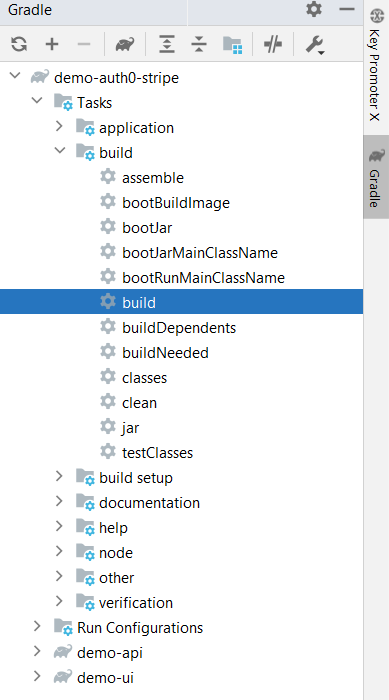
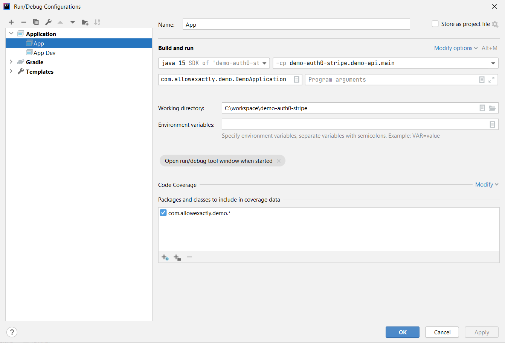
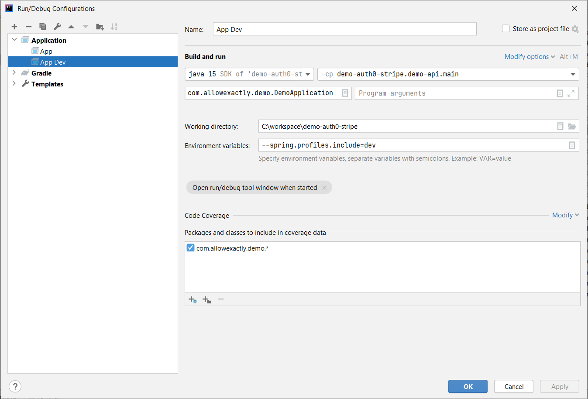

# demo-auth0-stripe

## Build

Run the gradle build task of parent project `demo-auth0-stripe` which will build both `demo-api` and `demo-ui`.

## Run in production mode

After build, application can be run from IntelliJ IDEA in production mode using the following configuration. This will expose both frontend and backend on `localhost:3000`

## Run in dev mode

Running in dev mode can be useful for fast UI development as React listens for changes and updates changes as files are modified.

After build, to run in dev mode, do the following:

- Run the app from IntelliJ IDEA using the following configuration. This will run the application on a different port (`localhost:9080`)

- Run `npm run dev` in `demo-ui` directory

This will run the UI in React dev mode on `localhost:9080` and is configured to send API calls to `localhost:9080`